# dsh-phalanx

[简体中文](README.zh-CN.md)

dsh-phalanx is a self-hosted, multi-user DSH platform for small teams: run DeepSeek Harness (DSH) on one server and give every member an independent user space.

Teams do not need to deploy DSH for each person or distribute shared model keys. The deployer installs the platform, administrators create accounts and configure shared model providers, and members sign in to work in their own spaces.

## Four highlights

- **One rootless container per member.** Each member's DSH instance runs in its own container, with persistent home and workspace directories kept separate from other members' files.
- **Integration through official DSH seams.** The platform uses DSH's official CLI, configuration, plugins and HTTP/WebSocket interfaces, without forking or modifying DSH source.
- **A shared model gateway.** Administrators configure shared model providers once; members select enabled models. Provider keys stay in the platform and never enter member spaces. Members can still access external models through their terminals and their own plugins.
- **Managed plugins and member choice.** Administrators prepare a plugin library, grant managed plugins to groups and publish optional plugins to the platform marketplace. Members can still install native DSH plugins and use the terminal and non-model settings. Managed plugins and the platform integration cannot be disabled or uninstalled through ordinary plugin management.

## How multi-user DSH works

A deployment consists of a platform service on the host and an independent DSH user instance for each member. The platform package provides sign-in, the admin UI and the model gateway; the matching image provides DSH and its tools. The platform starts a separate rootless Podman container for each member from the same image.

<picture>
  <source media="(prefers-color-scheme: dark)" srcset="docs/diagrams/overview-dark.svg">
  
</picture>

When a member visits `/app/<spaceId>/`, the request first reaches the platform service. The platform checks the login and user-space ownership, starts the member's DSH instance when needed, then forwards HTTP and WebSocket requests. Members use the native DSH interface in their browsers.

Shared model requests travel from the user instance to the platform's model gateway. The gateway selects the provider and injects its key when forwarding upstream. Members can use the models enabled by an administrator while provider keys stay in the platform.

| Part | Contents | How it is supplied |
| --- | --- | --- |
| Platform service | Sign-in, account management, admin UI, request forwarding and model gateway | Platform package, running on the host |
| DSH runtime | Built DSH workspace, native Web UI, production dependencies and Node.js | Matching container image |
| User tools | Corepack/pnpm, Git, curl, Python/pip, build tools and the bubblewrap sandbox tool | Matching container image, for terminals, plugins and DSH tools |
| User files | Each member's own home and workspace | Stored in the host's user data root and mounted into that member's container |
| Platform integration | Platform plugin, shared model catalog and configuration | Generated by the platform and mounted read-only; provider keys are excluded |

The [image recipe](containers/dsh/Containerfile) starts from a digest-pinned Node.js/Debian base, fetches the official DSH commit specified in [runtime-versions.json](runtime-versions.json), installs frozen dependencies and compiles DSH in a build stage. It then copies the built workspace and production dependencies into the runtime image. DSH source remains unchanged; integration uses its official CLI, configuration and plugins.

The image contains no accounts, model keys or member files. Accounts and provider keys stay in the platform data root; member files stay in their own mounted directories, which the platform reuses when rebuilding user instances. See [Contributing](CONTRIBUTING.md#build-the-dsh-instance-image) to build and import the image and verify container behavior.

Group grants are not an installation allowlist. Each account belongs to one group;
managed plugins supplement members' own installations. The platform does not manage
plugin configuration or plugin keys. See [Groups and plugins](docs/install.md#groups-and-plugins)
for publication, restart and recovery behavior.

## Quick installation

On an **Ubuntu 24.04 LTS, amd64 host with sudo access**, run:

```sh
curl -fsSLo install.sh https://raw.githubusercontent.com/dake6767/dsh-phalanx/main/install.sh && sudo bash install.sh
```

The installer selects the latest completed stable release and prepares host dependencies, the platform service and its matching DSH image. No developer Node.js/pnpm installation or model key is needed to install. Confirm the access address and public IPv4 inventory when prompted, open the initialization link to create the first administrator, then configure shared model providers.

The deployer configures HTTPS, DNS and cloud security groups. See the installation guide for detailed steps.

## Documentation

| What you need | Guide |
| --- | --- |
| Installation, storage, HTTPS, service management and recovery | [Installation guide](docs/install.md) · [简体中文](docs/install.zh-CN.md) |
| Layers, seam ownership, runtime guarantees and design tradeoffs | [Architecture](docs/architecture.md) |
| Local development, image builds, real DSH tests and the release process | [Contributing](CONTRIBUTING.md) |
| Changes and acceptance records for each release | [Releases](https://github.com/dake6767/dsh-phalanx/releases) |

## Community, license and trademarks

This is a community project, neither affiliated with nor endorsed by DeepSeek. Architecture discussions and reproducible issue reports are welcome. Maintenance is low-touch, with no support SLA or promised response time.

The code is licensed under [Apache-2.0](LICENSE). See [NOTICE](NOTICE) and the [trademark statement](TRADEMARKS.md). DSH and other external dependencies retain their own licenses and notices.
